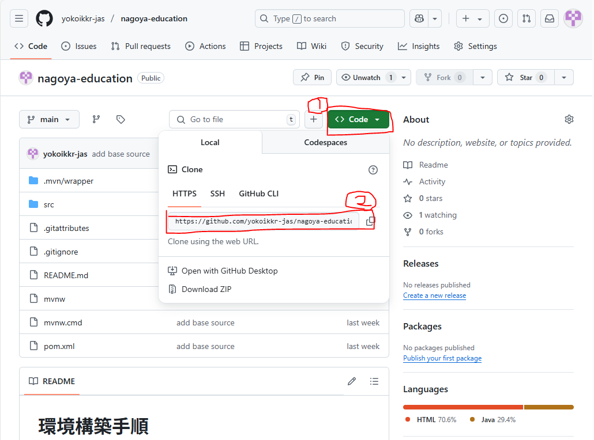

# 環境構築手順

## はじめに
下記の手順にしたがって環境構築を実施してください。\
迷った場合は先輩社員に相談すること。（そのまま突き進まない）

## 必要条件
- Windows10
- 独立環境に接続した端末で実施すること

## セットアップ
### VSCodeのインストール
1. [ここ](https://qiita.com/furu38/items/6776acba6621012ee475)の手順にしたがって、VSCodeをインストールする\
日本語化までの手順でOK、CloudFormationのインストール以降は実施不要
2. VSCodeを起動する
3. 下記の拡張機能をインストールする
     - Extension Pack for Java
     - Spring Boot Extension Pack
4. [ここ](https://qiita.com/ryo8000/items/60714fa9c5ce261c1798)の手順にしたがって、フォーマッターを設定する\
「1.フォーマッターファイルを用意」～「3.設定完了」までの手順でOK
5. [VSCode左下の歯車マーク] > [設定]で設定画面を開き、検索ボックスに"format"と入力すると、「Format On Save」という項目があるのでチェックをいれる

### JDKのインストール
1. [ここ](https://www.oracle.com/jp/java/technologies/downloads/#jdk21-windows)からJDKをインストールする\
インストーラーは[JDK 21] > [Windows] > [x64 Installer]を選択
2. [ここ](https://www.javadrive.jp/start/install/index4.html)の手順にしたがって、環境変数を設定する\
JDK、Windowsのバージョンが違うが、自端末のバージョンで読み替えてOK

### MVNのインストール
1. [ここ](https://web-dev.hatenablog.com/entry/maven/windows-install)の手順にしたがって、Mavenをインストールする

### Gitのインストール
1. [ここ](https://qiita.com/nmosfet556/items/5c306380ddf46a58e6a2)の手順にしたがって、Gitをインストールする\
初期設定手順ででてくる"user.name"は自分のフルネーム、"user.email"はJASメールアドレスとしてください
    ```
    $ git config --global user.name "kakeru yokoi"
    $ git config --global user.email "yokoikkr@jastec.co.jp"
    ```
   クローン（複製）はこのリポジトリのURLを使ってください（下記参考）\
   そうするとVsCode上でも手順書やソースを見れるはず
   

## アプリケーションの初回起動
0. 画面上部のタスクバーから、"ターミナル(T) > 新しいターミナル"を選択し、ターミナルを起動する
1. ソースのビルド（ターミナル上で下記コマンドを実行する）
    ```
    > mvn clean package  
    ```
2. アプリケーションの立ち上げ（ターミナル上で下記コマンドを実行する）
    ```
    > mvn spring-boot:run 
    ```
3. ブラウザ上で`http://localhost:8080/`にアクセスすることで、立ち上げたアプリケーションの初期画面が出てくる
4. アプリケーションを停止する（ターミナル上で`Ctr + C`）を押下